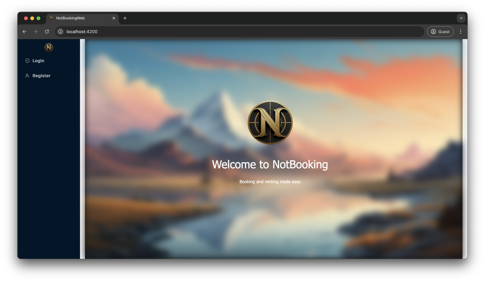
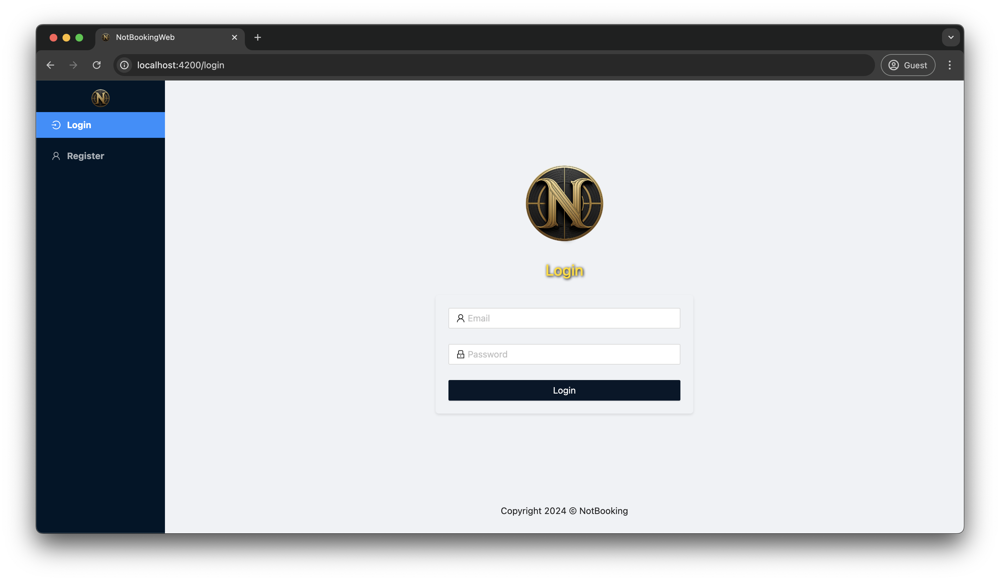
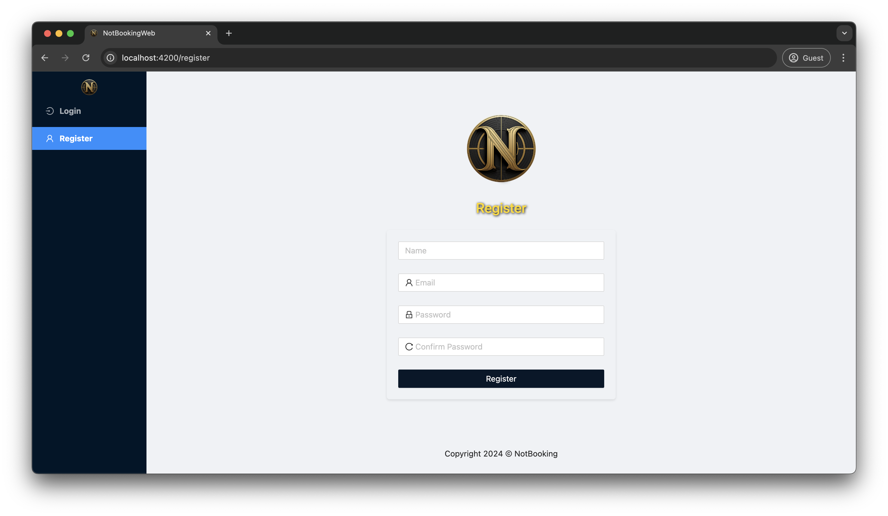
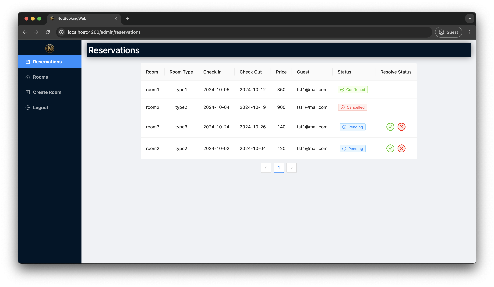
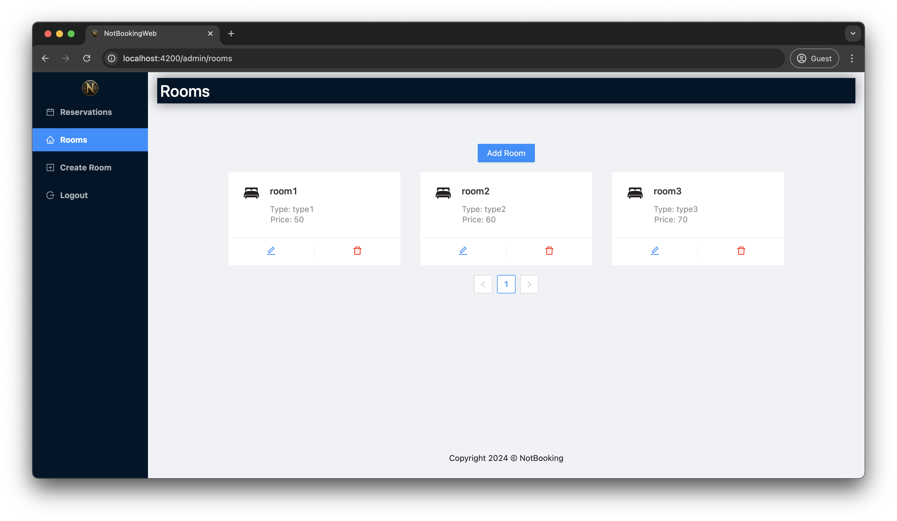
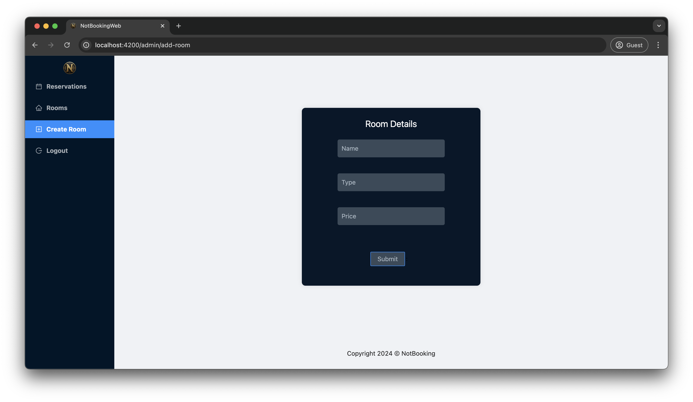
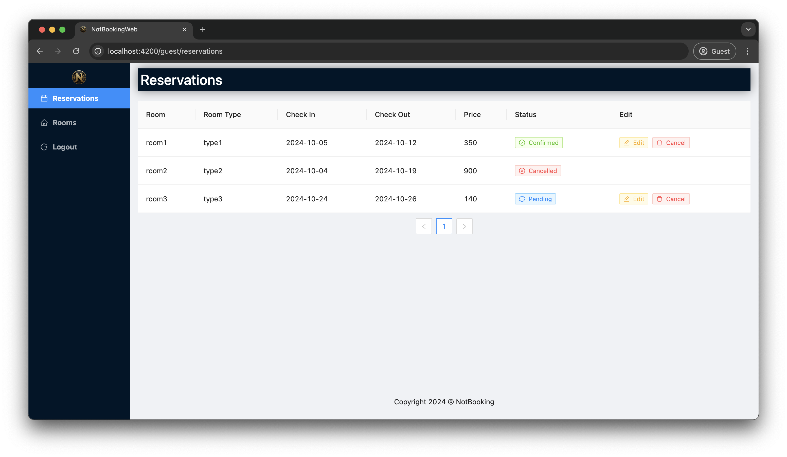
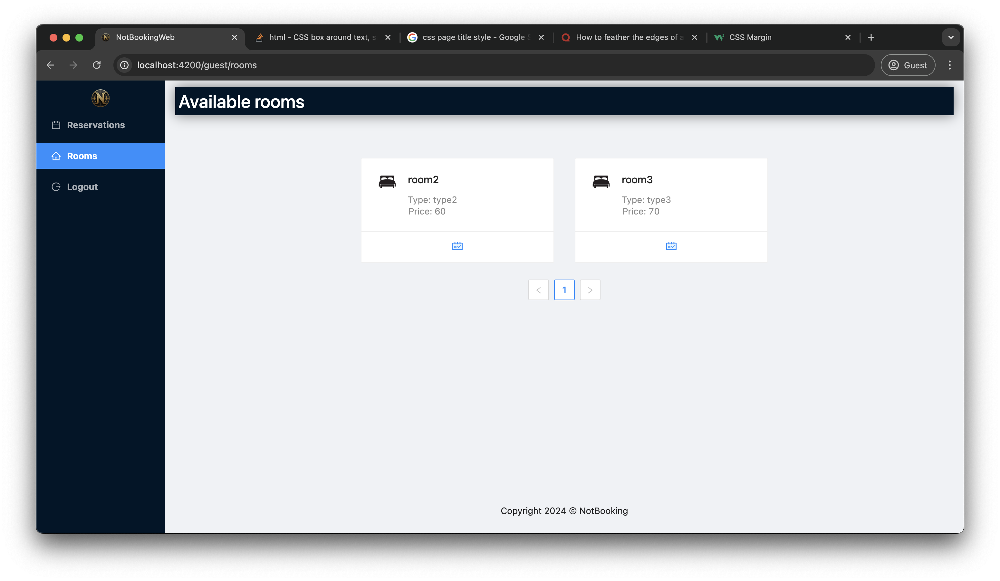
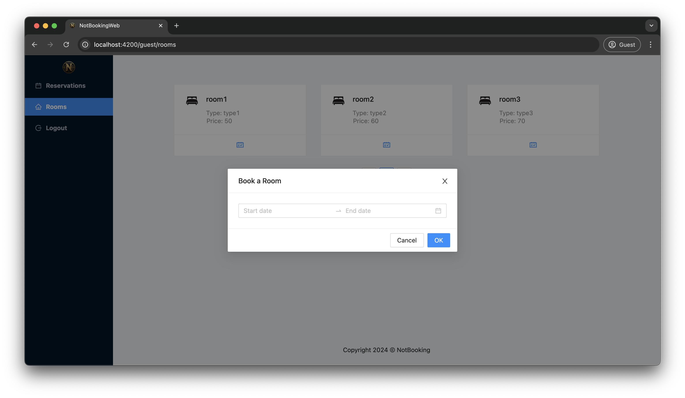

<!--  -->

# NotBooking

### Version: 0.3.0

A simple yet effective application for Apartment/Hotel management. Built with Angular 16 and Spring Boot 3.2.9.

---
---

# Installation

To run the application, Angular 16 and Spring Boot 3.2.9 are required with MySQL database (__notBooking_db__) on localhost:3306.
- Run `/NotBooking/src/main/java/com/StevanZecic/NotBooking/NotBookingApplication.java` as a Java file to start the server-side application
- Navigate to `/NotBookingWeb` in integrated terminal and execute command ___`ng serve`___ to start the client-side application
- In the browser, navigate to http://localhost:4200

---
---

# Usage

## PRE-LOGIN

### Welcome Screen

This is an entry point to the application. Here, user can choose to log in or to register.

### Login/Register Page

Existing users can log in to the application with their credentials (email and password).

New users can fill out a registration form and create an account. Account created this way will recieve a 'guest' role.

---

## ADMIN

### Reservations

This page is where admin user can manage reservations: accept or cancel them.

### Rooms

All existing rooms are listed here. New rooms can be created by clicking on the 'Add Room' button, which redirects to the Add Room page, which can be accessed by 'Create Room' menu item as well.

### Create Room

This is a page for adding new rooms. Filling out the form and clicking the 'Submit' button adds new room to the database.

---

## GUEST

### Reservations

All reservations created by the current user are listed on this page. Reservations with 'Pending' or 'Confirmed' status can be edited or cancelled. When edit is performed, the reservation is marked as 'cancelled' and new reservation request is created with the new dates.

### Rooms

All available rooms are listed on this page. User can choose a room and create a booking request for it.

### Booking a room

With a chosen room, user selects dates for the booking request and sends it to be reviewed by the admin.

---
---

# Changelog

- 0.0.1 /by Stevan Zecic = _Project initialization_
  - Created the project: Angular 16 project for user application and Spring Boot project for server-side application. Spring Initializr was used to create the Spring Boot project.
- 0.1.0 - _Basic server-side functionality_
  - Added dependencies
  - Connected the database
  - Added JWT authentication
  - New user registration functionality
  - CORS filtering configuration
- 0.1.1 - _Basic user application functionality_
  - Angular project removed and created again
  - NgZorroAntdModule added for NG-ZORRO configuration
  - Basic side navigation menu added
  - Register page added
- 0.1.2 - _Registration_
  - User registration functionality added
- 0.1.3 - _Login API_
  - Login added to NotBooking Spring project
    - AuthController path added
    - AuthenticationRequest and AuthenticationResponse added
    - UserService and UserServiceImpl added
    - JwtUtil fixed
    - WebSecurityConfiguration authentication added
- 0.1.4 - _Login page_
  - Login page added to NotBookingWeb client application
- 0.1.5 - _Admin and Guest modules_
  - register and login URL handling added to auth service
  - localStorage handling added
  - Admin and Guest modules added
  - Navitation panel adaptation based on the role of the logged in user
  - Login page validation changed so it accepts 'admin' as username
  - Added components for admin and guest modules which will be used for different displays
- 0.1.6 - _JWT token handling_
  - Added JWT token handling to the NotBooking application
  - Side menu changes
  - Added icon
- 0.1.7 - _Rooms API_
  - Added Rooms API
    - RoomRepository, RoomsController, RoomDTO and RoomsService added
  - Role based authentication added
- 0.1.8 - _Rooms page_
  - Add Room page added to NotBookingWeb client application
  - Adding Room form functionality added
- 0.1.9 - _Rooms fetching API_
  - RoomsResponseDTO added
  - Rooms fetching API with pagination added
- 0.1.10 - _Rooms page_
  - Rooms page added to NotBookingWeb client application
  - Rooms listing dashboard page for admin added
- 0.1.11 - _Rooms CRUD API_
  - Rooms Update and Delete API added
  - Rooms Update and Delete functionality added to NotBookingWeb client application (Dashboard)
- 0.1.12 - _Reservations API_
  - Reservations API added - entiity, repository, controller and service
  - Reservations listing dashboard page for guest added
- 0.1.13 - _Reservations Page_
  - Reservations updating added to NotBooking server-side application
  - Creating API and page added to NotBookingWeb client application
  - Reservations listing dashboard page for admin added, with confirmation and cancellation functionality
- 0.2.0 - _Bookings API_
  - Bookings API added - finding all user bookings
  - Bookings listing dashboard page for guest added, showing reservations and their status
- 0.2.1 - _Bookings Edit_
  - 'guest' can now edit or cancel their bookings
    - Editing bookings functionality added to NotBookingWeb client application (removal of old and creation of new booking request)
    - Deletion of bookings functionality added to NotBookingWeb client application
    - Booking removal API added to NotBooking server-side application
  - Minor changes to the UI
- 0.2.2 - _Welcome Screen_
  - Welcome screen added to NotBookingWeb client application
  - It is displayed before the user logs in and after login before the page is chosen
- 0.3.0 - _Bookings editing_
  - Bookings cancellation and editing logic changed:
    - If 'guest' cancels a booking, it is is marked as cancelled; that room is set as available
    - If 'guest' edits a booking, it is set as cancelled and new booking request with chosed dates is created
  - First version functionalities completed both for server-side and client-side applications
  - Minor fixes and structural changes
    - component /admin/dashboard renamed to /admin/rooms
    - url /guest/bookings renamed to /guest/reservations
  - Screenshots and walkthrough added to README.md

- - -
- - -
